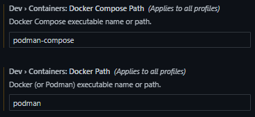
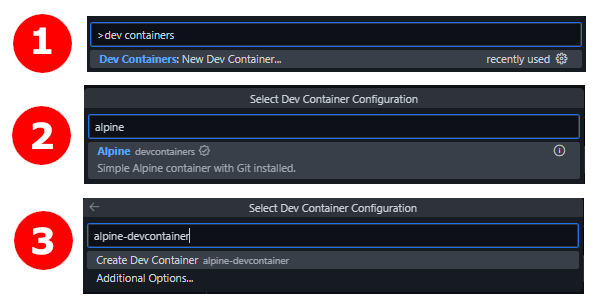
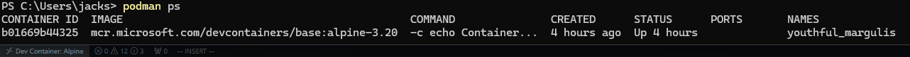
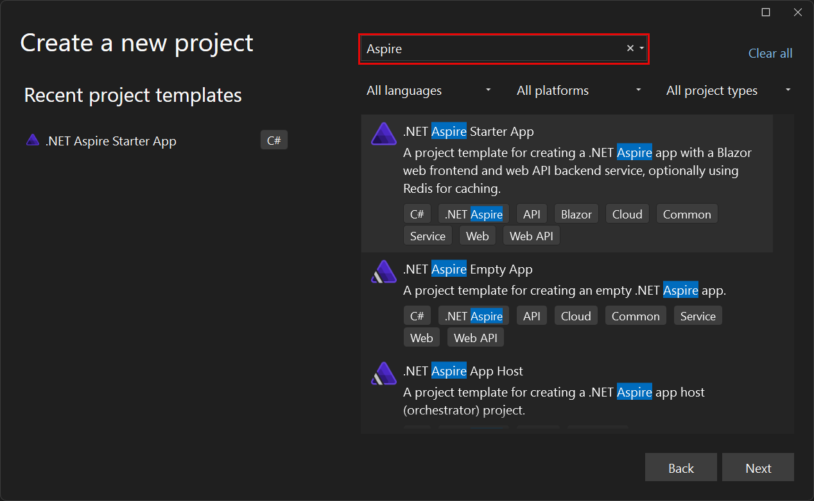
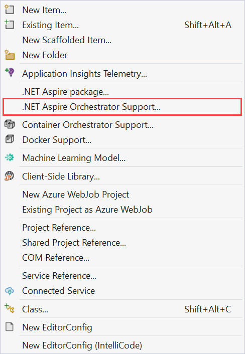

# Aspire & Dev Containers

## What is

### Aspire

Aspire aims to simplify development by providing tooling, templates & orchestrating local setup of multi-app applications.
This reduces time and complexity of setting up locally to just click run, and re-uses
this idea with running ethereal environments for integration tests.

The framework broken up to 3 components:

- **Orchestration**: A layer tackling app composition, service discovery & connection
string configuration automatically. It does this by spinning up containers, cloud 
resources or processes with lifecycle dependencies, then registering each one with 
service discovery and providing environment variables to each running app.
- **Integrations**: Allow developers to add services they require for their application
to run in an extensible form.
- **Tooling**: Using opinionated production-ready defaults, your app runs with Aspire
and should work out of the box, even providing templates with everything setup. Defaults
include OpenTelemetry, service discovery and health checks.

All of this will spit out an Aspire manifest used to run your multi-app application 
locally and be used to automatically deploy to the cloud (Azure or AWS only atm).

### Dev Containers

Dev containers is an implementation of the Dev Container Spec which aims to simplify
repeatable setup of local development environments and locally develop of your
application without having to setup locally any required software for other developers
whom may not have a full working knowledge of what is required to run your application,
all in a container for an ethereal development environment.

A development environment is specified using a `.devcontainer/devcontainer.json` file in order to 
create a Docker or Podman container with a pre-built or custom Dockerfile.

## Demo - Creating a .NET dev container

This demo assumes you're running windows but you can complete it in similar actions
for MacOS and Linux.

Pre-requisites:

- [WSL (v2)](https://learn.microsoft.com/en-us/windows/wsl/install) & Windows Terminal
- Docker or [Podman](https://github.com/containers/podman/releases) installed
- Visual Studio Code (VS Code)

1. Install Podman (an alternative to Docker): [Podman Releases](https://github.com/containers/podman/releases) (use brew for MacOS or Linux or your linux distro package manager)

2. Run Podman:

```sh
podman machine init
podman machine start
# Check Podman is running
podman info
podman ps
```

3. Install [Dev Containers](https://marketplace.visualstudio.com/items?itemName=ms-vscode-remote.remote-containers) VS Code Extension:

```sh
code --install-extension ms-vscode-remote.remote-containers
```

4. Update VS Code Ext Dev Containers to use Podman, using the UI



  or using the JSON settings directly:

```json
{
  "dev.containers.dockerPath": "podman",
  "dev.containers.dockerComposePath": "podman-compose"
}
```

5. Run a basic Alpine & git dev container from vscode command palette (`ctrl`/`cmd` + `p`):



  After a bit of spin up time, running the `podman ps` command from your terminal
  should show the pod your VS Code is connected into using a remote VS Code server.



6. Install C# Dev Kit VS Code Extension:

```sh
code --install-extension ms-dotnettools.csdevkit
```

7. Install .NET SDK:

```sh
sudo apk update && \
  sudo sudo apk add dotnet8-sdk
```

Now we'd be able to develop our .NET application in your container. However, when you
spin it down, you'll have to do the same actions all over again, not very repeatable
or a great experience. To avoid this we can use a container image with the .NET version
already installed in the image and install the extensions automatically by updating our
`.devcontainer.json`:

```json
{
    // ...
    "image": "mcr.microsoft.com/devcontainers/dotnet:8.0-bookworm",
    
    "postCreateCommand": "dotnet restore",

    "customizations": {
        "vscode": {
            "extensions": [
                "ms-dotnettools.csdevkit"
            ]
        }
    }
    // ...
}
```

The above container spec will spin up an image with .NET 8 SDK already installed,
install C# dev kit vscode extension and even run restore when the container is created!

## Demo - .NET Aspire application

1. To setup .NET Aspire you'll potentially need to update your Visual Studio 2022 and
install Aspire .NET project templates:
  `
  ```sh
  dotnet new install Aspire.ProjectTemplates
  ```

  if you have **both** Docker and Podman installed, you'll need to specify which one
  Aspire orchestrator should use, otherwise if you only have 1 installed, Aspire will
  automatically detect it and use it to run containers:

  ```sh
  # Mac/Linux
  export DOTNET_ASPIRE_CONTAINER_RUNTIME=podman
  # or
  export DOTNET_ASPIRE_CONTAINER_RUNTIME=docker

  # Windows
  [System.Environment]::SetEnvironmentVariable("DOTNET_ASPIRE_CONTAINER_RUNTIME", "podman", "User")
  # or
  [System.Environment]::SetEnvironmentVariable("DOTNET_ASPIRE_CONTAINER_RUNTIME", "docker", "User")
  ```

2. Using Visual Studio 2022, you can create a new .NET Aspire application with the
newly installed Aspire project template:


  or for existing projects, you can right click on your host project and simply
  add .NET Aspire support, which'll create the Aspire AppHost project and add the
  tooling defaults through Dependency Injection:

  

  N.B. If you're creating a new app, you can also use VS Code C# Dev Kit or the dotnet 
  cli. Instructions are found [here](https://learn.microsoft.com/en-us/dotnet/aspire/fundamentals/setup-tooling?tabs=windows&pivots=vscode).

3. Run your Aspire application by running the AppHost project:

  ```sh
  # Create a .NET self-signed cert for HTTPs, you only need to run once
  dotnet dev-certs https --trust

  dotnet run --project .\[Your App Name].AppHost

  # Click on the link Login to the dashboard at https://localhost:17073/login?t=XXX
  ```

  We can also check out the manifest Aspire generates, this is the context of how to
  run your application: `dotnet run --project .\[Your App Name].AppHost --publisher manifest --output-path ../aspire-manifest.json`:

  ```json
  {
    "$schema": "https://json.schemastore.org/aspire-8.0.json",
    "resources": {
      "apiservice": {
        "type": "project.v0",
        "path": "ExampleApp.ApiService/ExampleApp.ApiService.csproj",
        "env": {
          "OTEL_DOTNET_EXPERIMENTAL_OTLP_EMIT_EXCEPTION_LOG_ATTRIBUTES": "true",
          "OTEL_DOTNET_EXPERIMENTAL_OTLP_EMIT_EVENT_LOG_ATTRIBUTES": "true",
          "OTEL_DOTNET_EXPERIMENTAL_OTLP_RETRY": "in_memory",
          "ASPNETCORE_FORWARDEDHEADERS_ENABLED": "true",
          "HTTP_PORTS": "{apiservice.bindings.http.targetPort}"
        },
        "bindings": {
          "http": {
            "scheme": "http",
            "protocol": "tcp",
            "transport": "http"
          },
          "https": {
            "scheme": "https",
            "protocol": "tcp",
            "transport": "http"
          }
        }
      },
      "webfrontend": {
        "type": "project.v0",
        "path": "ExampleApp.Web/ExampleApp.Web.csproj",
        "env": {
          "OTEL_DOTNET_EXPERIMENTAL_OTLP_EMIT_EXCEPTION_LOG_ATTRIBUTES": "true",
          "OTEL_DOTNET_EXPERIMENTAL_OTLP_EMIT_EVENT_LOG_ATTRIBUTES": "true",
          "OTEL_DOTNET_EXPERIMENTAL_OTLP_RETRY": "in_memory",
          "ASPNETCORE_FORWARDEDHEADERS_ENABLED": "true",
          "HTTP_PORTS": "{webfrontend.bindings.http.targetPort}",
          "services__apiservice__http__0": "{apiservice.bindings.http.url}",
          "services__apiservice__https__0": "{apiservice.bindings.https.url}"
        },
        "bindings": {
          "http": {
            "scheme": "http",
            "protocol": "tcp",
            "transport": "http",
            "external": true
          },
          "https": {
            "scheme": "https",
            "protocol": "tcp",
            "transport": "http",
            "external": true
          }
        }
      }
    }
  }
  ```

  Read more on how the manifest works [here](https://learn.microsoft.com/en-us/dotnet/aspire/deployment/manifest-format).

4. To deploy to the cloud, we can leverage Aspire and it's context on how our 
  application links together and generates a manifest of it to deploy to Azure.
  Using the Aspire manifest we can deploy by:
  
  a) Deploy to Azure Containers using the Azure Developer CLI (`azd`) which'll
  translate the manifest into Azure Bicep (you can also convert Bicep to Terraform
  using [Azure Terrafy](https://techcommunity.microsoft.com/blog/itopstalkblog/azure-terrafy-%E2%80%93-import-your-existing-azure-infrastructure-into-terraform-hcl/3357653))

  b) Deploy to Kubernetes using [Aspir8](https://prom3theu5.github.io/aspirational-manifests/getting-started.html)
  which'll translate the manifest to Kubernetes manifest

5. We can also add integration/functional tests into XUnit, NUnit or MSTest test
project and reference the Aspire project to build. This will then go and spin up the
project locally, again in containers and processes using the Aspire orchestrator +
service discovery, to allow your test to hit endpoints and run test cases against.

  We do this by utilizing `DistributedApplicationTestingBuilder` like so:

  ```csharp
  public class IntegrationTest1
  {
      [Fact]
      public async Task GetWebResourceRootReturnsOkStatusCode()
      {
          // Arrange
          var builder = await DistributedApplicationTestingBuilder
              .CreateAsync<Projects.AspireApp_AppHost>();

          builder.Services.ConfigureHttpClientDefaults(clientBuilder =>
          {
              clientBuilder.AddStandardResilienceHandler();
          });

          await using var app = await builder.BuildAsync();

          await app.StartAsync();

          // Act
          var httpClient = app.CreateHttpClient("webfrontend");

          using var cts = new CancellationTokenSource(TimeSpan.FromSeconds(30));
          await app.ResourceNotifications.WaitForResourceHealthyAsync(
              "webfrontend",
              cts.Token);

          var response = await httpClient.GetAsync("/");

          // Assert
          Assert.Equal(HttpStatusCode.OK, response.StatusCode);
      }
  }
  ```

  This means anything you change infrastructure-wise for you local development will
  automatically be part of your integration test! .NET Aspire tries to be as feature 
  parity as [test containers](https://testcontainers.com/guides/getting-started-with-testcontainers-for-dotnet/).